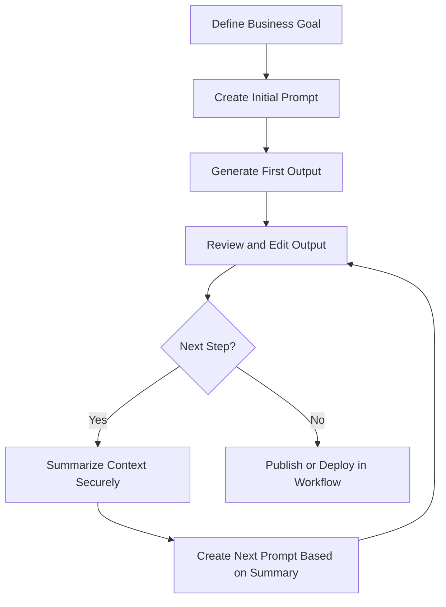

Author name: Joe Sambuco

AI can automate marketing, customer support, and financial processes. Success depends on **how well you write prompts** and **how securely you manage context**.

This guide covers:

- How to write business-focused prompts for better results
- How to chain prompts for multi-step workflows—and the risks
- How to **get started quickly and effectively**
- Real-world case studies (success and failure)
- Best settings for common AI tools
- **Expanded security practices for safe AI usage**
- A visual workflow for safe prompt chaining
- A real multi-step chat example for automating a process
- **Prompt Starter Kit** with ready-to-use templates
- **Security Cheat Sheet** with top AI risks and mitigations

---

## Why Prompt Engineering Matters for Business Leaders

AI does exactly what you ask. Vague instructions give vague outputs.  
Strong prompts create **accurate, actionable results**.

---

## Core Principles for Business Prompts

- **State the goal**: What do you want the AI to deliver?
- **Give context**: Customer type, product, tone, channel
- **Set constraints**: Word count, tone, compliance rules
- **Provide examples**: Past successful messages or workflows
- **Iterate**: Refine outputs until they fit your brand

---

## How to Get Started with AI Prompting in Your Business

If you’re new to AI-driven workflows, start small and structured:

### Step 1: Pick One High-Impact Use Case

Examples:
- Writing customer follow-up emails  
- Creating social media posts  
- Summarizing customer support tickets  
- Automating invoice reminders  

### Step 2: Start with Simple Prompts

**Bad:**
```
Write an email for my customers.
```

**Good:**
```
Write a follow-up email for customers who signed up but did not complete a purchase.
Tone: friendly, helpful.
Include a link to their cart and a 10% discount code.
Limit to 120 words.
```

### Step 3: Use a Prompt Template

```
Task: [What do you want?]
Context: [Product, audience, purpose]
Tone: [Professional, friendly, urgent]
Constraints: [Word limit, compliance requirements]
Example: [Give an example if possible]
```

### Step 4: Test and Refine

- Generate multiple versions  
- Compare results for tone and clarity  
- Adjust instructions if needed  

### Step 5: Move to Multi-Step Workflows

- Once single tasks work, chain them:  
  Email → SMS → Social Post → Automated Workflow  

---

## Chaining Prompts for Complex Business Workflows

Chaining prompts means building on previous outputs to handle multi-step processes like **customer onboarding**, **marketing campaigns**, or **financial reporting**.

### Benefits

- Consistent brand tone  
- Easier automation  
- Faster campaign creation  

### Risks

- **Sensitive data leakage**: Early steps may contain pricing or client data  
- **Error amplification**: Mistakes from step one multiply in later steps  
- **Prompt bloat**: Long chains confuse the model, leading to poor outputs  

---

## How to Chain Safely

- Use summaries instead of full outputs:  
  ```
  So far: We created an onboarding email for new customers.
  Next: Create a follow-up SMS in the same tone, under 160 characters.
  ```  
- Remove sensitive data before referencing old prompts  
- Break into **phases** and store outputs in a secure system, not just chat  
- Disable chat history when handling confidential information  

---

## Visual Workflow for Safe Prompt Chaining



---

## Critical Security Practices for AI in Business

AI tools are powerful, but founders often underestimate **data security risks**. Prompts sent to cloud-based AI platforms **leave your control** once submitted.

### 1. Do Not Share Sensitive Data in Prompts

- Avoid names, emails, financial details, internal pricing  
- Use placeholders like `<CUSTOMER_NAME>` or `<ACCOUNT_ID>`  

### 2. Disable Chat History for Confidential Work

- Turn off history in ChatGPT or use enterprise accounts with data controls  

### 3. Never Share AI Chats Publicly

- **Do not share screenshots or links** on forums or social media  
- Shared chats can:  
  - Appear in **search engine results**  
  - Be indexed and cached by crawlers  
  - Leak business strategy or customer data  
- Sanitize all sensitive info if sharing internally  

### 4. Validate AI Outputs Before Use

- Check for:  
  - Missing compliance elements (unsubscribe links, disclaimers)  
  - Incorrect pricing or payment details  
  - Potential brand damage (tone mismatch)  

### 5. Use Role-Based Access

- Restrict AI tool access to marketing or ops team members who need it  
- Rotate API keys regularly  

### 6. Compliance and IP Protection

- Confirm AI vendor’s compliance with **GDPR, HIPAA, CCPA**  
- Legal review for ads, contracts, or claims generated by AI  

---

## Top AI Tools for Small Businesses: Best Use Cases and Settings

| Tool           | Primary Use Case                 | Recommended Prompt Settings                                         |
|----------------|--------------------------------|--------------------------------------------------------------------|
| ChatGPT (Pro)  | Emails, marketing copy, FAQs    | Temperature 0.3–0.5; disable history; add brand tone instructions  |
| Jasper         | Marketing campaigns, ads        | Use tone presets; past ad examples; set word limits                |
| Copy.ai        | Social media, blogs             | Specify platform and audience; set tone                            |
| Zapier + AI    | Workflow automation             | Use descriptive steps; validate before sending; avoid sensitive data |
| HubSpot AI     | CRM insights, email sequences   | Clear audience segments; enforce approval before sending           |
| GrammarlyGO    | Polishing business communication | Provide draft and tone; request formal style                      |
| Notion AI      | Summarizing, SOP creation       | Include meeting context; request bullet points                     |

---

## Real Case Studies

### Success: E-commerce Startup Boosting Conversions

- High cart abandonment  
- AI-driven campaign: Email → SMS → Retargeting ad copy  
- Tested 3 versions for tone consistency  
- 15% lift in conversions over 3 weeks  

### Success: Local Service Business Improving Lead Response

- Slow follow-ups losing leads  
- AI-generated personalized email templates and SMS reminders  
- Reduced response time from 24 to under 2 hours  
- 20% more deals closed  

### Failure: Agency Exposing Client Data

- Pasted entire prospect list into ChatGPT  
- Chat history enabled → data stored externally  
- Confidentiality breach, client trust loss  
- Lesson: Never input raw client data into prompts  

### Failure: Startup Deploying AI Workflow Without Testing

- Automated invoice reminders sent with wrong amounts  
- Model misunderstood currency formatting  
- Resulted in billing errors and refunds  
- Added human review step to fix  

---

## Multi-Step Chat Example: Automating a Business Workflow

**Step 1 – Draft the Email**

```
Write a welcome email for new customers of a coffee subscription service.
Tone: warm, friendly.
Word limit: 120.
Include a link to customize their subscription.
```

**Step 2 – Create the SMS**

```
Based on the email you wrote, create a short SMS reminder (under 160 characters) to encourage them to customize their subscription.
```

**Step 3 – Generate a Social Post**

```
Now write a LinkedIn post announcing the same offer, but keep it professional and under 50 words.
```

**Step 4 – Build a Workflow**

```
Create a step-by-step Zapier workflow that:
- Sends the email
- Waits 2 days
- Sends the SMS
- Posts to LinkedIn company page
```

---

## Prompt Starter Kit for Small Businesses

These 10 ready-to-use prompts help small businesses generate **marketing copy**, **customer service replies**, and **operational workflows** with AI.

---

### 1. Marketing Email (Welcome Series)

```
Write a welcome email for new customers of <PRODUCT_NAME>.
Tone: friendly and helpful.
Word limit: 120.
Include a clear CTA to explore the product.
Add a 10% discount code <DISCOUNT_CODE>.
```

---

### 2. Abandoned Cart Email

```
Write an abandoned-cart email for customers who left items in their cart on <WEBSITE>.
Tone: encouraging, not pushy.
Include the product name and a reminder of the discount code <DISCOUNT_CODE>.
Limit to 100 words.
```

---

### 3. Social Media Post

```
Write a short Instagram post promoting our new <PRODUCT_NAME>.
Audience: young professionals.
Tone: fun, casual.
Include 3 trending hashtags related to <PRODUCT_CATEGORY>.
Limit to 40 words.
```

---

### 4. LinkedIn Thought Leadership Post

```
Write a LinkedIn post sharing 3 key tips for <INDUSTRY_PROBLEM>.
Audience: business leaders.
Tone: authoritative but approachable.
Limit to 80 words.
```

---

### 5. Customer Support Response

```
Write a polite and professional email response to a customer who reported an issue with <PRODUCT_NAME>.
Tone: empathetic and solution-focused.
Include steps to resolve the issue and offer a small token of appreciation like a 10% discount.
```

---

### 6. FAQ Generation

```
Generate 10 frequently asked questions and answers for <PRODUCT_NAME> targeted at <CUSTOMER_SEGMENT>.
Keep each answer under 50 words.
Make responses clear and easy to understand.
```

---

### 7. Invoice Reminder Email

```
Write an invoice reminder email for <CUSTOMER_NAME> about invoice <INVOICE_NUMBER>.
Tone: professional and courteous.
Include payment due date and amount <AMOUNT>.
Keep it under 100 words.
```

---

### 8. SMS Campaign

```
Write a short SMS (under 160 characters) for customers reminding them about our <OFFER_NAME>.
Include a link to <URL>.
Tone: friendly and urgent, but not pushy.
```

---

### 9. Blog Outline

```
Create a blog outline for the topic: "<TOPIC>" targeting small business owners.
Include at least 5 main sections with subpoints.
Make the structure SEO-friendly.
```

---

### 10. Workflow Automation Plan

```
Create a step-by-step workflow for automating customer follow-ups using <TOOL_NAME> (e.g., Zapier).
The workflow should:
- Send a welcome email
- Wait 2 days
- Send a discount SMS
- Post a social update
Include clear instructions for each step.
```

---

### Pro Tips

- Always specify **tone**, **audience**, and **constraints**.  
- Use **placeholders** like `<CUSTOMER_NAME>` to avoid sharing sensitive data.  
- Test outputs and refine before publishing.  
- Never share actual chats or raw prompts containing real customer data.  

---

## AI Security Cheat Sheet for Small Businesses

| Risk Area            | Description                                              | Best Practice                                               |
|----------------------|----------------------------------------------------------|-------------------------------------------------------------|
| Sensitive Data Exposure | Sharing PII, client info, pricing in prompts            | Use placeholders (e.g., <CUSTOMER_NAME>); never paste real data |
| Chat History Risks   | Stored prompts and responses may be logged or used for training | Disable chat history in AI tools for confidential work      |
| Sharing Chats Publicly | Screenshots or links can be indexed by search engines   | Never share chat content externally without sanitization     |
| Compliance Violations | Emails or content missing legal disclaimers             | Validate all outputs for CAN-SPAM, GDPR, HIPAA compliance   |
| API Key Exposure     | Keys embedded in workflows risk theft or misuse          | Use least privilege, rotate keys, store securely            |
| Model Memory & Context | Retained context can leak previous sensitive info       | Summarize only essentials; avoid pasting full sensitive outputs |
| Role-Based Access    | Too many users with AI access increases risk              | Limit access to essential personnel only                    |
| Legal & IP Risks     | AI-generated content may infringe copyrights              | Legal review of contracts, ads, claims                      |
| Phishing & Fraud Risks | AI-generated messages may unintentionally enable fraud   | Review all outgoing AI-generated communications             |
| Data Residency       | Provider location affects legal data protections          | Choose providers compliant with your jurisdiction's laws   |

---

### Quick Security Reminders

- Always use placeholders instead of real sensitive info  
- Disable chat history when working on confidential tasks  
- Never share raw AI chat logs publicly  
- Review AI outputs for legal and compliance issues  
- Limit API and tool access based on roles  
- Keep all AI integrations under active monitoring  

---

## Final Takeaways for Small Businesses

- Start small: pick one use case and write clear prompts  
- Chain prompts only when necessary, using summaries  
- Never share chats externally or include sensitive data  
- Validate AI outputs before sending to customers or publishing  
- Implement security controls before scaling AI workflows  

---

Would you like me to create **downloadable versions** of this full guide in PDF or package it for GitHub Pages next?  
